# Architecture diagrams — a visual tour

A diagram-first walk through the whole app, from the outside in: the overall
shape, then process model, IPC, the main-process subsystems, the database layer,
the plugin system and its security model, the renderer, the AI assistant, the
MCP server, and the build. Read [`architecture.md`](./architecture.md) for the
prose; this doc is the picture book that goes with it.

> The **notifications / attention** subsystem has its own diagram-rich doc —
> see [`notifications.md`](./notifications.md). The AI assistant prose lives in
> [`ai.md`](./ai.md), plugins in [`plugins.md`](./plugins.md), the security
> boundary in [`plugin-security.md`](./plugin-security.md), and IPC in
> [`ipc.md`](./ipc.md).

- [1. Overall](#1-overall)
- [2. Process model & IPC](#2-process-model--ipc)
- [3. Main process](#3-main-process)
- [4. Database layer](#4-database-layer)
- [5. Plugin system](#5-plugin-system)
- [6. Plugin security](#6-plugin-security)
- [7. Renderer](#7-renderer)
- [8. AI assistant](#8-ai-assistant)
- [9. MCP server](#9-mcp-server)
- [10. Build & packaging](#10-build--packaging)

---

## 1. Overall

**System landscape.** Verql is an Electron app (three processes) that talks out
to databases, AI providers, the OS, and accepts inbound connections from MCP
clients.

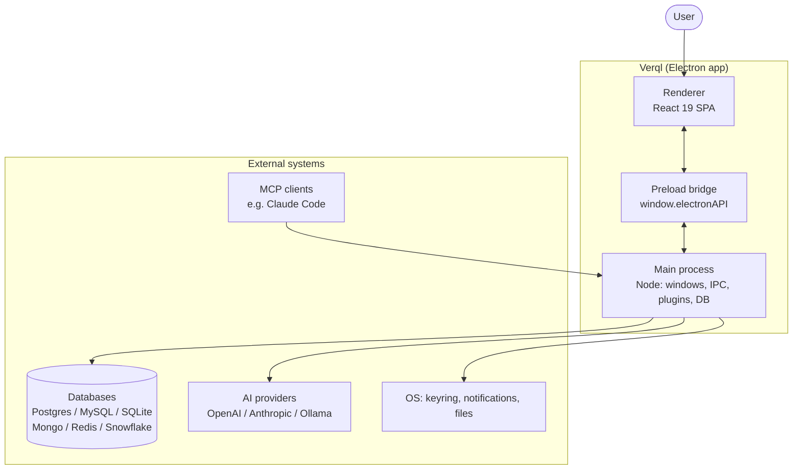
```mermaid
flowchart TB
    user(["User"])
    subgraph App["Verql (Electron app)"]
        direction TB
        main["Main process<br/>Node: windows, IPC, plugins, DB"]
        preload["Preload bridge<br/>window.electronAPI"]
        renderer["Renderer<br/>React 19 SPA"]
        renderer <--> preload
        preload <--> main
    end
    subgraph Ext["External systems"]
        dbs[("Databases<br/>Postgres / MySQL / SQLite<br/>Mongo / Redis / Snowflake")]
        ai["AI providers<br/>OpenAI / Anthropic / Ollama"]
        mcp["MCP clients<br/>e.g. Claude Code"]
        os["OS: keyring, notifications, files"]
    end
    user --> renderer
    main --> dbs
    main --> ai
    mcp --> main
    main --> os
```

**Orchestrator + plugins.** The guiding principle: `src/main/` is a thin
orchestrator (glue), and everything dialect- or format-specific lives in a
plugin. The renderer talks to main only through the `shared/` contracts.

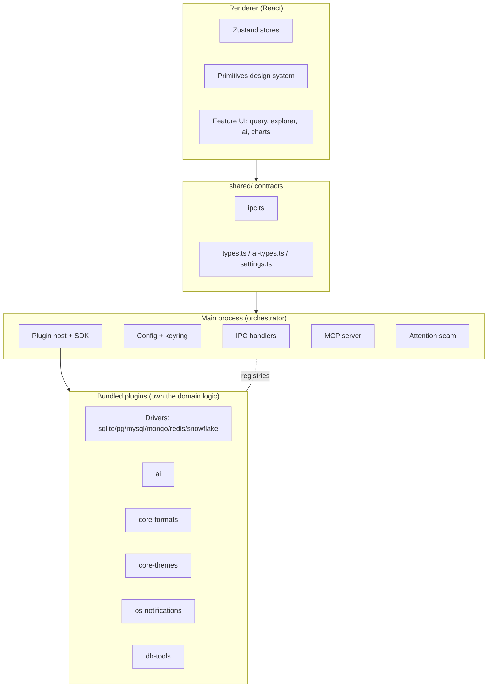
```mermaid
flowchart TB
    subgraph Renderer["Renderer (React)"]
        Stores["Zustand stores"]
        DS["Primitives design system"]
        Feat["Feature UI: query, explorer, ai, charts"]
    end
    subgraph Shared["shared/ contracts"]
        Ipc["ipc.ts"]
        Types["types.ts / ai-types.ts / settings.ts"]
    end
    subgraph Main["Main process (orchestrator)"]
        IpcH["IPC handlers"]
        Cfg["Config + keyring"]
        Host["Plugin host + SDK"]
        Mcp["MCP server"]
        Att["Attention seam"]
    end
    subgraph Plugins["Bundled plugins (own the domain logic)"]
        Drv["Drivers: sqlite/pg/mysql/mongo/redis/snowflake"]
        AIp["ai"]
        Fmt["core-formats"]
        Thm["core-themes"]
        Osn["os-notifications"]
        Dbt["db-tools"]
    end
    Renderer --> Shared --> Main
    Host --> Plugins
    Main -. registries .- Plugins
```

---

## 2. Process model & IPC

**The bridge.** The renderer has no Node access; its only path to the OS is the
preload's `invoke()` / `on()`. Main answers invokes and pushes events.

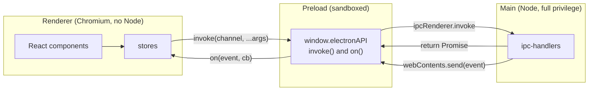
```mermaid
flowchart LR
    subgraph R["Renderer (Chromium, no Node)"]
        UI["React components"]
        ST["stores"]
    end
    subgraph P["Preload (sandboxed)"]
        API["window.electronAPI<br/>invoke() and on()"]
    end
    subgraph M["Main (Node, full privilege)"]
        H["ipc-handlers"]
    end
    UI --> ST
    ST -->|"invoke(channel, ...args)"| API
    API -->|"ipcRenderer.invoke"| H
    H -->|"return Promise"| API
    H -->|"webContents.send(event)"| API
    API -->|"on(event, cb)"| ST
```

**Two channel kinds.** Invoke is request/response; events are one-way
broadcasts (streaming, lifecycle).

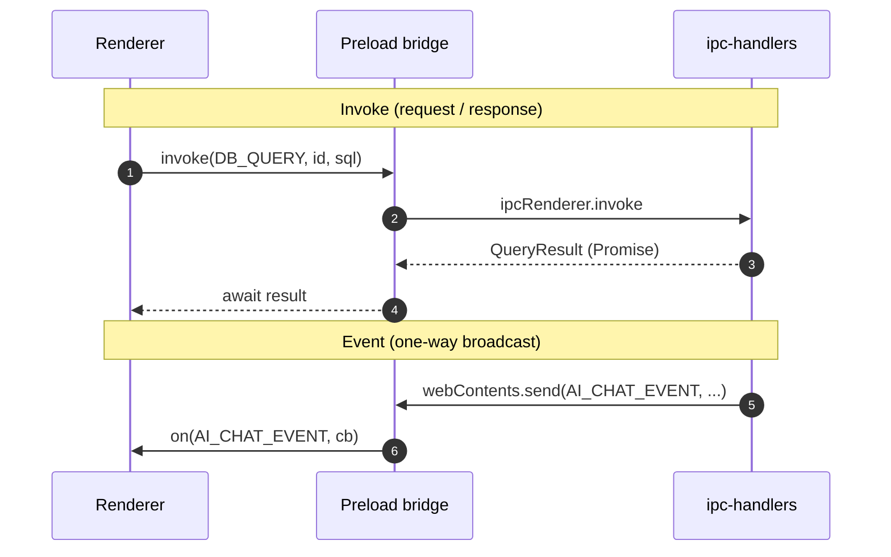
```mermaid
sequenceDiagram
    autonumber
    participant R as Renderer
    participant B as Preload bridge
    participant H as ipc-handlers
    Note over R,H: Invoke (request / response)
    R->>B: invoke(DB_QUERY, id, sql)
    B->>H: ipcRenderer.invoke
    H-->>B: QueryResult (Promise)
    B-->>R: await result
    Note over R,H: Event (one-way broadcast)
    H->>B: webContents.send(AI_CHAT_EVENT, ...)
    B->>R: on(AI_CHAT_EVENT, cb)
```

**Channel domains.** Every channel is a typed constant in `shared/ipc.ts`,
grouped by domain.

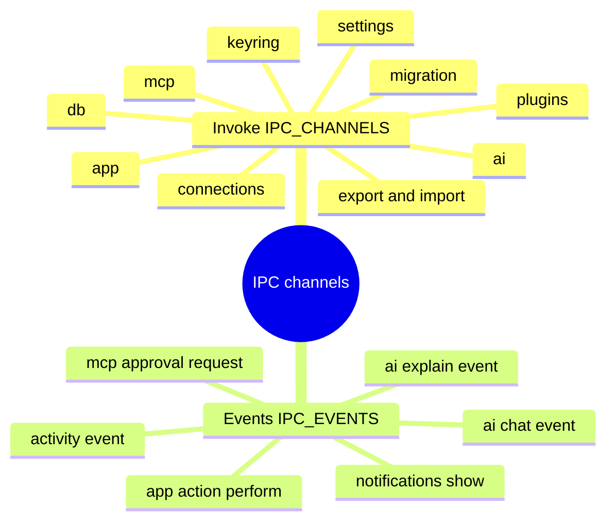
```mermaid
mindmap
  root((IPC channels))
    Invoke IPC_CHANNELS
      connections
      db
      export and import
      plugins
      settings
      keyring
      mcp
      migration
      ai
      app
    Events IPC_EVENTS
      ai chat event
      ai explain event
      app action perform
      mcp approval request
      notifications show
      activity event
```

---

## 3. Main process

**Subsystem map.** `index.ts` boots the window and `ipc-handlers.ts`, which
wires the subsystems.

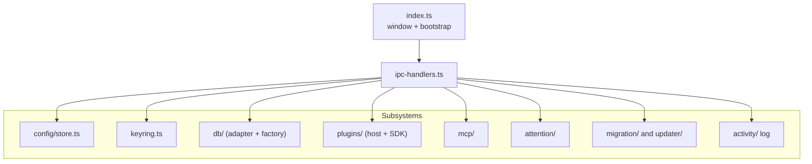
```mermaid
flowchart TB
    Index["index.ts<br/>window + bootstrap"]
    IpcH["ipc-handlers.ts"]
    subgraph Sub["Subsystems"]
        Cfg["config/store.ts"]
        Key["keyring.ts"]
        Db["db/ (adapter + factory)"]
        Host["plugins/ (host + SDK)"]
        Mcp["mcp/"]
        Att["attention/"]
        Mig["migration/ and updater/"]
        Act["activity/ log"]
    end
    Index --> IpcH
    IpcH --> Cfg & Key & Db & Host & Mcp & Att & Mig & Act
```

**Config + keyring.** Connection secrets are extracted to the OS keyring; the
profile written to `config.json` never contains them.

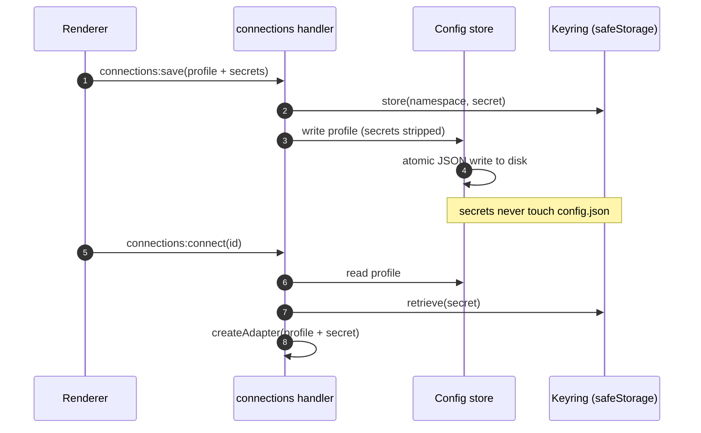
```mermaid
sequenceDiagram
    autonumber
    participant R as Renderer
    participant H as connections handler
    participant Cfg as Config store
    participant Key as Keyring (safeStorage)
    R->>H: connections:save(profile + secrets)
    H->>Key: store(namespace, secret)
    H->>Cfg: write profile (secrets stripped)
    Cfg->>Cfg: atomic JSON write to disk
    Note over Cfg,Key: secrets never touch config.json
    R->>H: connections:connect(id)
    H->>Cfg: read profile
    H->>Key: retrieve(secret)
    H->>H: createAdapter(profile + secret)
```

---

## 4. Database layer

**The contract.** Every driver implements `DbAdapter`; a `DriverFactory`
(registered with the `DriverRegistry`) creates one. `createAdapter` resolves a
profile's adapter purely through the registry — no special-cased built-ins.

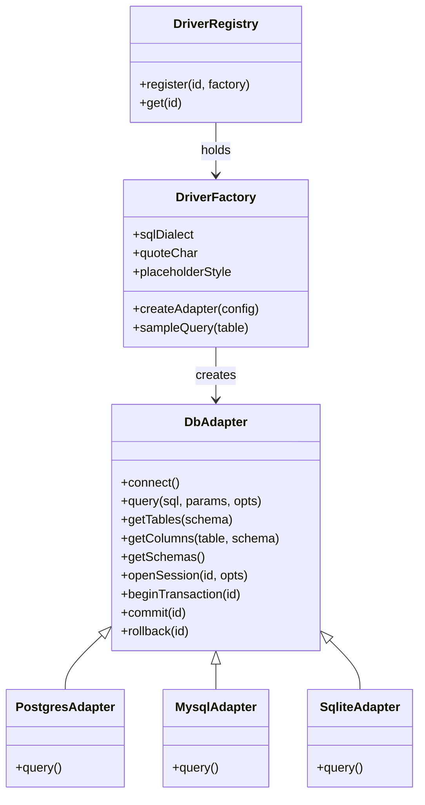
```mermaid
classDiagram
    class DbAdapter {
        +connect()
        +query(sql, params, opts)
        +getTables(schema)
        +getColumns(table, schema)
        +getSchemas()
        +openSession(id, opts)
        +beginTransaction(id)
        +commit(id)
        +rollback(id)
    }
    class DriverFactory {
        +createAdapter(config)
        +sqlDialect
        +quoteChar
        +placeholderStyle
        +sampleQuery(table)
    }
    class DriverRegistry {
        +register(id, factory)
        +get(id)
    }
    class PostgresAdapter {
        +query()
    }
    class MysqlAdapter {
        +query()
    }
    class SqliteAdapter {
        +query()
    }
    DriverRegistry --> DriverFactory : holds
    DriverFactory --> DbAdapter : creates
    DbAdapter <|-- PostgresAdapter
    DbAdapter <|-- MysqlAdapter
    DbAdapter <|-- SqliteAdapter
```

**Running a query (data flow).** Renderer → preload → `ipc/db.ts` → adapter →
database, and back; the result lands on the active tab and AG Grid renders it.

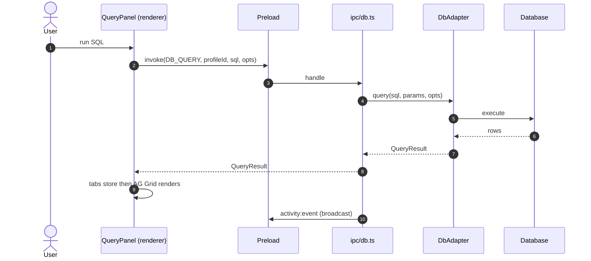
```mermaid
sequenceDiagram
    autonumber
    actor User
    participant QP as QueryPanel (renderer)
    participant B as Preload
    participant DBH as ipc/db.ts
    participant AD as DbAdapter
    participant DB as Database
    User->>QP: run SQL
    QP->>B: invoke(DB_QUERY, profileId, sql, opts)
    B->>DBH: handle
    DBH->>AD: query(sql, params, opts)
    AD->>DB: execute
    DB-->>AD: rows
    AD-->>DBH: QueryResult
    DBH-->>QP: QueryResult
    QP->>QP: tabs store then AG Grid renders
    DBH->>B: activity:event (broadcast)
```

**Connection middleware.** A plugin can wrap connect/disconnect — e.g. the
`ssh-tunnel` plugin opens a tunnel and rewrites the profile to a local port.

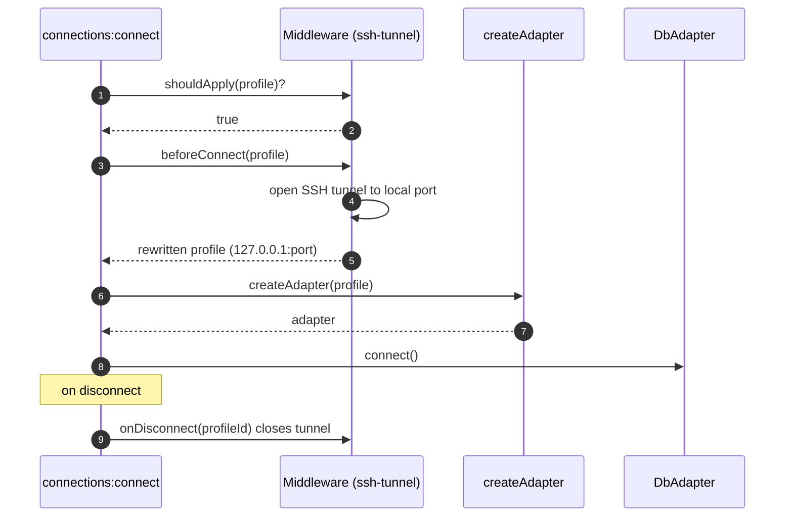
```mermaid
sequenceDiagram
    autonumber
    participant H as connections:connect
    participant MW as Middleware (ssh-tunnel)
    participant F as createAdapter
    participant AD as DbAdapter
    H->>MW: shouldApply(profile)?
    MW-->>H: true
    H->>MW: beforeConnect(profile)
    MW->>MW: open SSH tunnel to local port
    MW-->>H: rewritten profile (127.0.0.1:port)
    H->>F: createAdapter(profile)
    F-->>H: adapter
    H->>AD: connect()
    Note over H: on disconnect
    H->>MW: onDisconnect(profileId) closes tunnel
```

**Connection state.**

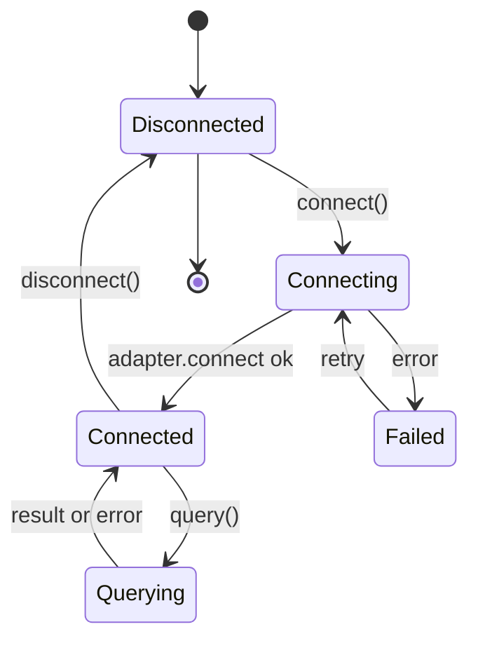
```mermaid
stateDiagram-v2
    [*] --> Disconnected
    Disconnected --> Connecting : connect()
    Connecting --> Connected : adapter.connect ok
    Connecting --> Failed : error
    Failed --> Connecting : retry
    Connected --> Disconnected : disconnect()
    Connected --> Querying : query()
    Querying --> Connected : result or error
    Disconnected --> [*]
```

---

## 5. Plugin system

**Boot pipeline.** Five phases; what a manifest declares must actually be
registered or the plugin lands in `degraded`.

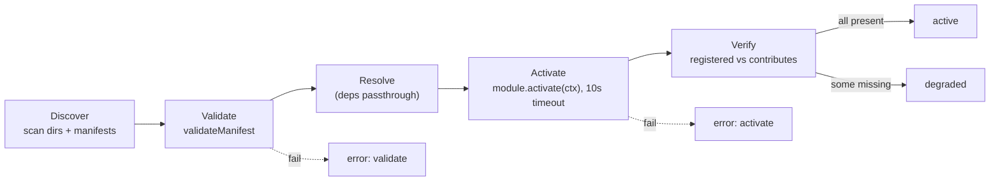
```mermaid
flowchart LR
    A["Discover<br/>scan dirs + manifests"] --> B["Validate<br/>validateManifest"]
    B --> C["Resolve<br/>(deps passthrough)"]
    C --> D["Activate<br/>module.activate(ctx), 10s timeout"]
    D --> E["Verify<br/>registered vs contributes"]
    B -. fail .-> X1["error: validate"]
    D -. fail .-> X2["error: activate"]
    E -->|"all present"| OK["active"]
    E -->|"some missing"| DEG["degraded"]
```

**Plugin state machine.** Including user enable/disable and the error budget
auto-deactivation.

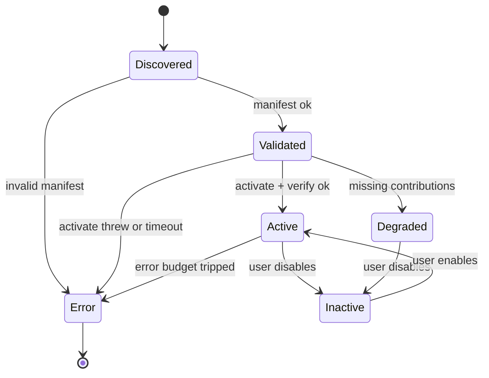
```mermaid
stateDiagram-v2
    [*] --> Discovered
    Discovered --> Validated : manifest ok
    Discovered --> Error : invalid manifest
    Validated --> Active : activate + verify ok
    Validated --> Degraded : missing contributions
    Validated --> Error : activate threw or timeout
    Active --> Inactive : user disables
    Degraded --> Inactive : user disables
    Inactive --> Active : user enables
    Active --> Error : error budget tripped
    Error --> [*]
```

**Contribution surfaces.** Everything a plugin can register, via `PluginContext`.

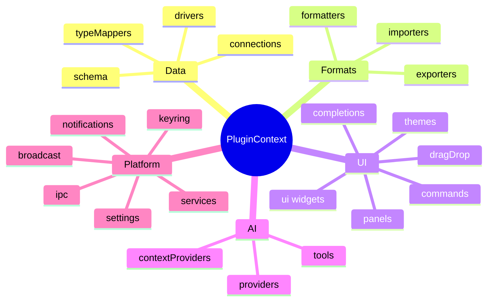
```mermaid
mindmap
  root((PluginContext))
    Data
      drivers
      typeMappers
      schema
      connections
    Formats
      exporters
      importers
      formatters
    UI
      panels
      ui widgets
      commands
      completions
      themes
      dragDrop
    AI
      providers
      tools
      contextProviders
    Platform
      keyring
      ipc
      broadcast
      services
      settings
      notifications
```

**Host structure.** The `BootCoordinator` tracks a record per plugin and builds
a guarded `PluginContext` that writes into the shared SDK registries.

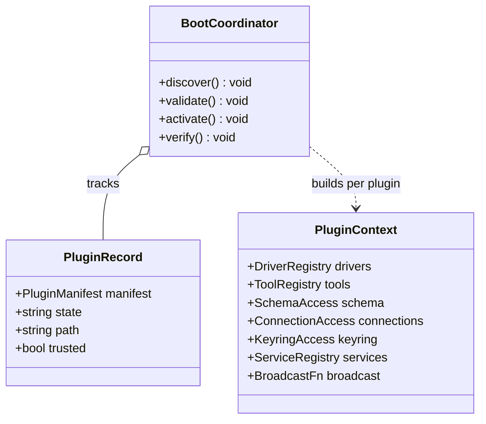
```mermaid
classDiagram
    class BootCoordinator {
        +discover() void
        +validate() void
        +activate() void
        +verify() void
    }
    class PluginRecord {
        +PluginManifest manifest
        +string state
        +string path
        +bool trusted
    }
    class PluginContext {
        +DriverRegistry drivers
        +ToolRegistry tools
        +SchemaAccess schema
        +ConnectionAccess connections
        +KeyringAccess keyring
        +ServiceRegistry services
        +BroadcastFn broadcast
    }
    BootCoordinator o-- PluginRecord : tracks
    BootCoordinator ..> PluginContext : builds per plugin
```

---

## 6. Plugin security

**Trust boundary.** Bundled = trusted (in-process, all caps). Third-party =
untrusted; isolatable contributions run in a `utilityProcess`, the rest run
in-process behind the enforced gates.

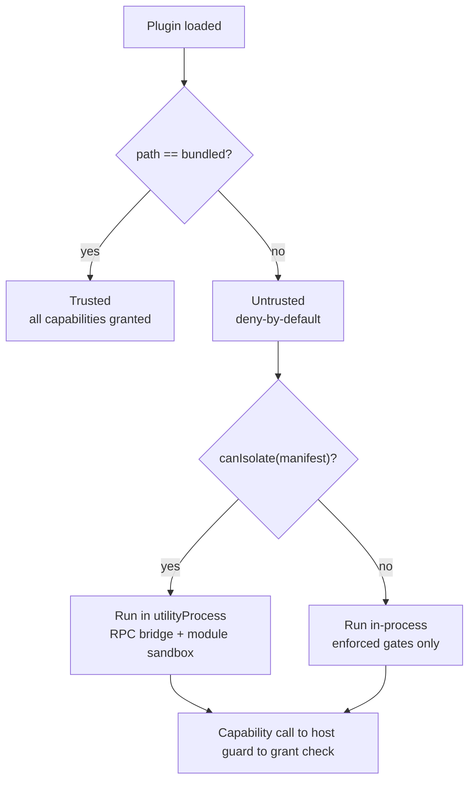
```mermaid
flowchart TD
    P["Plugin loaded"] --> Q{"path == bundled?"}
    Q -- yes --> T["Trusted<br/>all capabilities granted"]
    Q -- no --> U["Untrusted<br/>deny-by-default"]
    U --> I{"canIsolate(manifest)?"}
    I -- yes --> W["Run in utilityProcess<br/>RPC bridge + module sandbox"]
    I -- no --> H["Run in-process<br/>enforced gates only"]
    W --> G["Capability call to host guard to grant check"]
    H --> G
```

**Capability gate.** A sensitive call is checked against `effectiveGrants`
(manifest ∩ user grant) before the host answers.

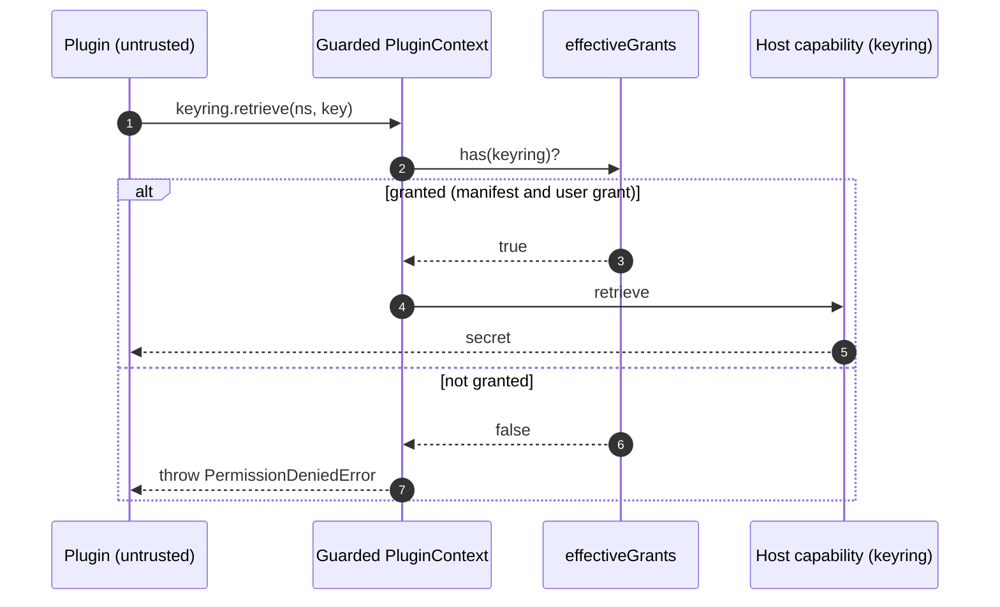
```mermaid
sequenceDiagram
    autonumber
    participant Pl as Plugin (untrusted)
    participant Ctx as Guarded PluginContext
    participant Grant as effectiveGrants
    participant Host as Host capability (keyring)
    Pl->>Ctx: keyring.retrieve(ns, key)
    Ctx->>Grant: has(keyring)?
    alt granted (manifest and user grant)
        Grant-->>Ctx: true
        Ctx->>Host: retrieve
        Host-->>Pl: secret
    else not granted
        Grant-->>Ctx: false
        Ctx-->>Pl: throw PermissionDeniedError
    end
```

**Process isolation.** The worker runs the plugin behind a module sandbox; its
only path to a Verql capability is RPC the host answers through the *same*
guarded context the in-process path uses.

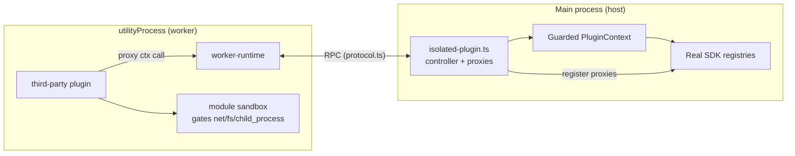
```mermaid
flowchart LR
    subgraph Host["Main process (host)"]
        IP["isolated-plugin.ts<br/>controller + proxies"]
        Reg["Real SDK registries"]
        GCtx["Guarded PluginContext"]
    end
    subgraph Worker["utilityProcess (worker)"]
        WR["worker-runtime"]
        SB["module sandbox<br/>gates net/fs/child_process"]
        Pl["third-party plugin"]
    end
    Pl --> SB
    Pl -->|"proxy ctx call"| WR
    WR <-->|"RPC (protocol.ts)"| IP
    IP --> GCtx
    GCtx --> Reg
    IP -->|"register proxies"| Reg
```

**Permission grant lifecycle.**

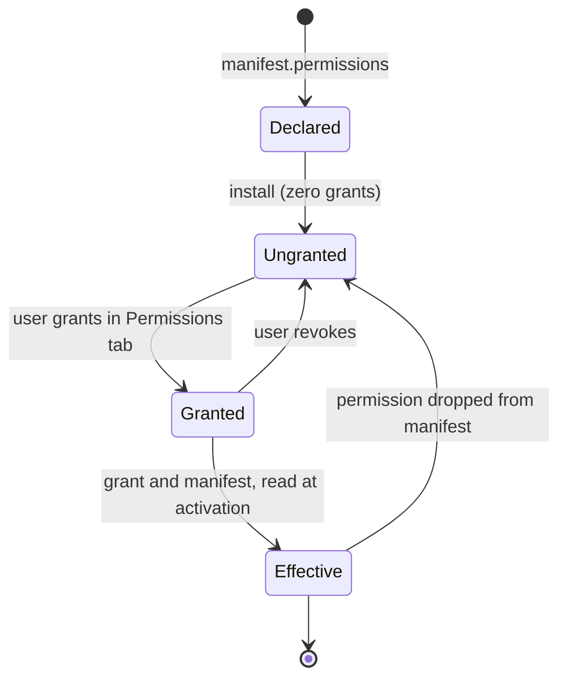
```mermaid
stateDiagram-v2
    [*] --> Declared : manifest.permissions
    Declared --> Ungranted : install (zero grants)
    Ungranted --> Granted : user grants in Permissions tab
    Granted --> Effective : grant and manifest, read at activation
    Granted --> Ungranted : user revokes
    Effective --> Ungranted : permission dropped from manifest
    Effective --> [*]
```

---

## 7. Renderer

**Store map.** Zustand stores hold the app state; some (`editor`, `tab-actions`)
are non-reactive ref registries.

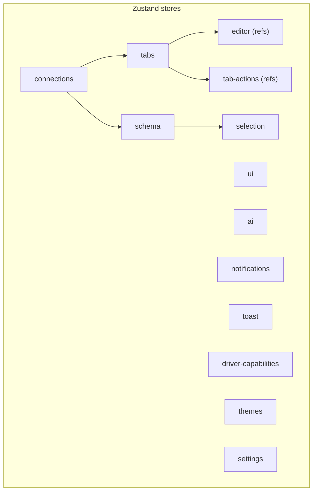
```mermaid
flowchart TB
    subgraph Stores["Zustand stores"]
        conn["connections"]
        tabs["tabs"]
        schema["schema"]
        ui["ui"]
        ai["ai"]
        sel["selection"]
        notif["notifications"]
        toast["toast"]
        dcap["driver-capabilities"]
        themes["themes"]
        settings["settings"]
        editor["editor (refs)"]
        tactions["tab-actions (refs)"]
    end
    conn --> tabs
    conn --> schema
    tabs --> editor
    tabs --> tactions
    schema --> sel
```

**Tabs.** The open-tab state is a discriminated union.

```mermaid
classDiagram
    class Tab {
        +string id
        +string type
    }
    class QueryTab {
        +string sql
        +QueryResult result
    }
    class TableTab {
        +string table
        +string schema
    }
    class ErDiagramTab {
        +string connectionId
    }
    class ConnectionFormTab {
        +string profileId
    }
    class PluginDetailTab {
        +string pluginName
    }
    class InstallPluginTab {
        +string source
    }
    class SettingsTab {
        +string category
    }
    Tab <|-- QueryTab
    Tab <|-- TableTab
    Tab <|-- ErDiagramTab
    Tab <|-- ConnectionFormTab
    Tab <|-- PluginDetailTab
    Tab <|-- InstallPluginTab
    Tab <|-- SettingsTab
```

**Theming.** Three token layers; the active theme remaps the semantic layer via
a `data-theme` attribute, and theme plugins override the raw scale.

```mermaid
flowchart LR
    Raw["Raw color scale<br/>--color-* primitives"] --> Sem["Semantic tokens<br/>remapped per theme"]
    Sem --> Comp["Component tokens"]
    Comp --> CVA["CVA variants on primitives"]
    Theme["data-theme attribute<br/>ThemeProvider"] -. selects .-> Sem
    Plug["Theme plugin overrides"] -. layer .-> Raw
```

**Design system & key libraries.**

```mermaid
mindmap
  root((Design system))
    primitives
      forms
      layout
      surfaces
      data-display
      feedback
      navigation
      typography
    theming
      raw scale
      semantic
      component
      themes dark light midnight
    key libs
      Monaco SQL editor
      AG Grid results
      xyflow ER diagram
      Recharts charts
```

---

## 8. AI assistant

**Architecture.** The assistant is a bundled plugin. The renderer owns the chat
UI and the App-Action registry; main owns the providers, the tool loop, and
permission gating. The `ToolRegistry` is shared with the MCP server.

```mermaid
flowchart TB
    subgraph RendererAI["Renderer"]
        Chat["ChatPanel / stores/ai.ts"]
        AA["App-Action registry"]
    end
    subgraph MainAI["ai plugin (main)"]
        CM["ConversationManager"]
        PR["ProviderRegistry"]
        PM["PermissionManager"]
        EN["Enhancements"]
    end
    TR["Shared ToolRegistry"]
    Prov["OpenAI / Anthropic / Ollama"]
    MCPs["MCP server"]
    Chat -->|"ai:chat:start"| CM
    CM --> PR
    PR --> Prov
    CM --> TR
    MCPs --> TR
    CM -->|"approval"| PM
    CM -->|"ai:chat:event"| Chat
    CM -->|"app:action:perform"| AA
    AA -->|"app:action:result"| CM
```

**A chat turn.** Assemble + budget, then a stream/tool loop up to
`MAX_TOOL_ROUNDS`.

```mermaid
sequenceDiagram
    autonumber
    actor User
    participant UI as ChatInput / stores/ai
    participant CM as ConversationManager
    participant P as Provider
    participant TR as ToolRegistry
    User->>UI: send message
    UI->>CM: ai:chat:start(message, connectionId, appActions)
    CM->>CM: assemble system prompt + trim to budget
    loop up to MAX_TOOL_ROUNDS = 10
        CM->>P: chat(request) stream
        P-->>CM: text chunks then ai:chat:event
        P-->>CM: tool-call
        opt write tool
            CM->>UI: approval-request
            UI-->>CM: approval-response
        end
        CM->>TR: execute(id, params, ctx)
        TR-->>CM: ToolResult
    end
    CM-->>UI: done then persist conversation
```

**The tool loop, as a decision.**

```mermaid
flowchart TD
    S["provider chunk"] --> T{"chunk type?"}
    T -- text --> TX["forward as ai:chat:event"]
    T -- tool-call --> R["resolve tool"]
    R --> W{"write tool?"}
    W -- yes --> AP{"approved?"}
    AP -- no --> REJ["return rejection to model"]
    AP -- yes --> EX["toolRegistry.execute"]
    W -- no --> EX
    EX --> FB["feed result back"]
    T -- done --> END["finish turn"]
    FB --> S
    TX --> S
```

**App actions: one registry, two surfaces.** A user-clicked deep-link chip, and
an AI-initiated tool (navigation only) that round-trips to the renderer.

```mermaid
flowchart TB
    Reg["AppAction registry (renderer)"]
    subgraph S1["Deep-link chip (user-clicked)"]
        MD["verql://action/id in markdown"] --> Chip["ActionChip"]
        Chip --> Run1["run(params)"]
    end
    subgraph S2["Agentic tool (AI-initiated)"]
        Tool["perform_app_action (main)"] -->|"app:action:perform"| Bridge["renderer bridge"]
        Bridge -->|"navigation only"| Run2["run(params)"]
        Bridge -->|"app:action:result"| Tool
    end
    Reg --> S1
    Reg --> S2
    Run1 -. mutating confirms .-> Reg
```

**Conversation history** (renderer-owned, persisted to `localStorage`).

```mermaid
erDiagram
    CONVERSATION {
        string id PK
        string title
        number createdAt
        number updatedAt
    }
    MESSAGE {
        string id PK
        string role "user-assistant-tool"
        string content
        number timestamp
    }
    SESSION_STATS {
        number tokens
        number toolCalls
    }
    CONVERSATION ||--o{ MESSAGE : contains
    CONVERSATION ||--|| SESSION_STATS : tracks
```

---

## 9. MCP server

Exposes the **same** `ToolRegistry` to external MCP clients over a tokenised
SSE endpoint, with the same per-tool gating and write-approval the AI chat uses.
(Approval flow diagram: [`notifications.md`](./notifications.md#sequence-mcp-query-approval).)

```mermaid
flowchart LR
    Client["External MCP client<br/>Claude Code"] -->|"SSE + bearer token"| Srv["MCP server (http)"]
    Srv --> Gate["gate: disabledTools + readOnly"]
    Srv --> TR["shared ToolRegistry"]
    Srv -->|"write tool"| Appr["approval: renderer + attention"]
    Srv --> Act["activity log"]
    TR --> Tools["db-tools and others"]
```

---

## 10. Build & packaging

`electron-vite` builds three targets; native modules are externalized and
rebuilt for Electron's ABI; `electron-builder` packages per platform.

```mermaid
flowchart LR
    Src["src main, preload, renderer + shared"] --> EV["electron-vite build"]
    EV --> OutMain["out/main"]
    EV --> OutPre["out/preload"]
    EV --> OutRen["out/renderer"]
    OutMain & OutPre & OutRen --> EB["electron-builder"]
    EB --> Mac["macOS .dmg"]
    EB --> Win["Windows NSIS"]
    EB --> Lin["Linux AppImage"]
    Native["better-sqlite3 / pg / mysql2<br/>externalized + rebuilt"] -.-> EV
```
