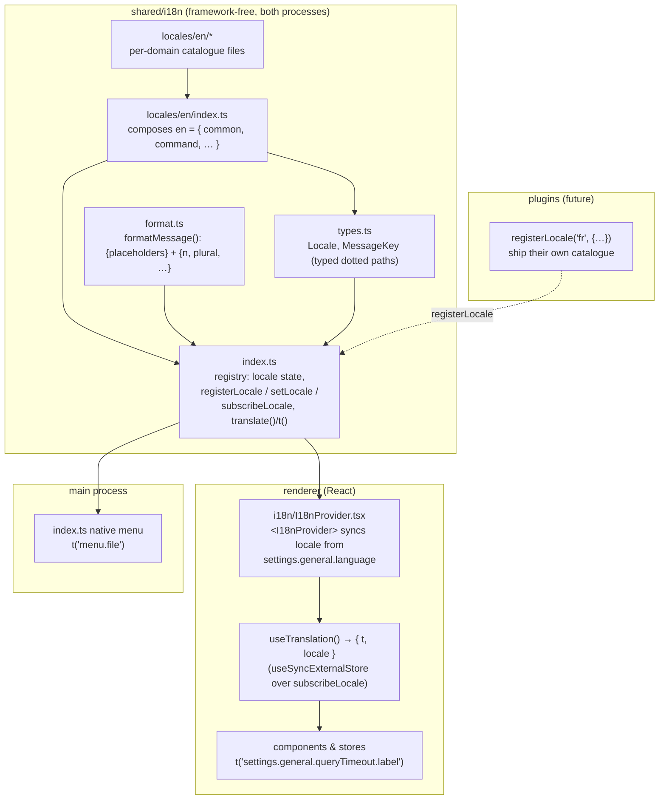
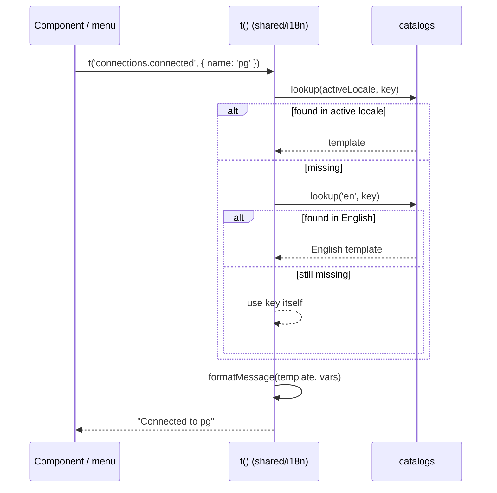
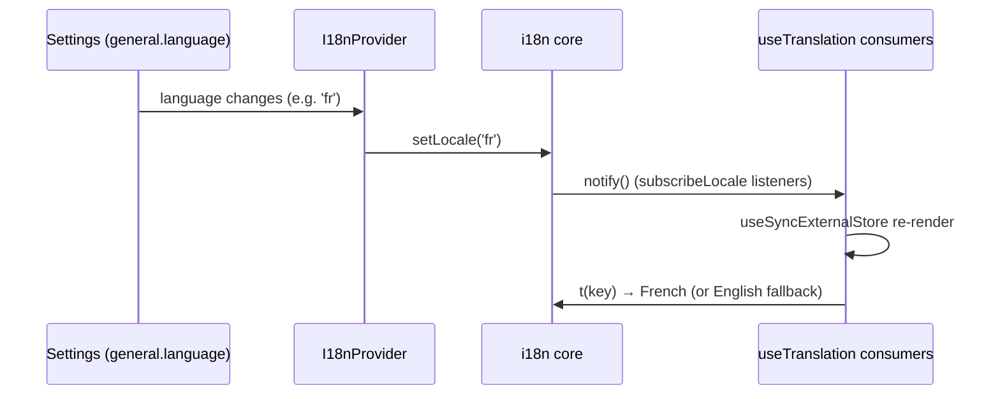

# Internationalization (i18n)

Verql centralizes every user-facing string in a typed message catalogue so copy
can be edited in one place and the app can be translated later. The subsystem is
**homegrown, dependency-free, and cross-process** — the same catalogue and
`t()` work in the renderer (React) and the main process (menus, etc.).

> Read order: this doc → `shared/i18n/` (the core) → `src/renderer/src/i18n/`
> (the React layer). Keep this doc in sync with the code when you change the
> catalogue shape or the resolution rules.

## Goals

- **One home for copy.** No hardcoded UI strings; everything resolves through a
  key. Editing wording is a catalogue change, not a code hunt.
- **Translation-ready.** English ships in-bundle as the default and the
  structural source of truth; other locales register at runtime and fall back to
  English per-key.
- **Cross-process.** Both Electron processes import the same core.
- **Lean.** No runtime dependency; a tiny formatter instead of a full ICU engine.
- **Plugin-friendly.** Plugins can ship their own catalogues without touching the
  host's, respecting the glue↔plugin boundary.

## Architecture



### The core — `shared/i18n/`

| File | Responsibility |
|------|----------------|
| `format.ts` | `formatMessage(template, vars)` — the ICU **subset** formatter: `{name}` placeholders and `{count, plural, one {# row} other {# rows}}` (with optional `=N` exact matches; `#` renders the count). English plural rules. No dependencies. |
| `locales/en/*.ts` | The English catalogue, **one file per domain** (`common`, `command`, `settings`, `connections`, `menu`, …). Each exports `const <domain> = { … } as const`. |
| `locales/en/index.ts` | Composes the domain modules into `en` — the structural source of truth. |
| `index.ts` | The registry: holds the active locale + registered catalogues, exposes `registerLocale`, `setLocale`, `getLocale`, `availableLocales`, `subscribeLocale`, and `translate()` / `t()`. |
| `types.ts` | `Locale`, `Messages`, `MessageKey` (typed dotted key paths derived from `en`), `LocaleCatalog` (a deep-partial of `en`). |

### The React layer — `src/renderer/src/i18n/I18nProvider.tsx`

- `<I18nProvider>` keeps the core's active locale in sync with the user's
  `general.language` setting.
- `useTranslation()` returns `{ t, locale }`; it re-renders its consumers when
  the locale changes (via `useSyncExternalStore` over the core's
  `subscribeLocale`).
- `useLocale()` exposes the active locale on its own.

## How translation resolves

`t(key, vars)` resolves a key against the **active** locale, then **English**,
then falls back to the **raw key** (so a missing string is visible, never blank).
The chosen template is then formatted with `vars`.



## Switching locale (reactivity)



The main process is not reactive: it calls `setLocale()` once (if needed) and
then `t()` when building the menu. Rebuilding the menu on a live locale change is
not wired yet (English-only today).

## Key naming convention

`domain.surface.key`, lowerCamelCase leaves. Examples:

- `common.resetToDefaults`
- `command.category.view`
- `settings.general.queryTimeout.label` / `.description`
- `connections.connected` → `'Connected to {name}'`
- `menu.about` → `'About {appName}'`

Group by **where the string appears**, not by component name, so moving a
component doesn't churn keys.

## Authoring strings

### Add or change a string

1. Add the key to the right `shared/i18n/locales/en/<domain>.ts` file (create a
   new domain module + import it in `locales/en/index.ts` if needed).
2. Use it:
   - **React:** `const { t } = useTranslation()` then `t('domain.key')`.
   - **Stores / non-React / main:** `import { t } from '@shared/i18n'`.
3. `MessageKey` is derived from `en`, so unknown keys are a **compile error** and
   keys autocomplete.

### Interpolation & plurals

```ts
t('connections.connected', { name })            // "Connected to {name}"
t('explorer.rowCount', { count })               // "{count, plural, one {# row} other {# rows}}"
```

- Placeholders: `{name}` — unknown names are left as `{name}` (visible, not a crash).
- Plurals: `{count, plural, one {…} other {…}}`, optional `=0 {…}`; `#` renders
  the count. English rules only — a locale can extend `pluralCategory` in
  `format.ts`.

### Add a locale

```ts
import { registerLocale, setLocale } from '@shared/i18n'

registerLocale('fr', {
  common: { resetToDefaults: 'Réinitialiser' },
  connections: { connected: 'Connecté à {name}' },
  // …partial; missing keys fall back to English
})
setLocale('fr')
```

A locale catalogue is a **deep-partial** of `en` (`LocaleCatalog`), so you only
translate what you have; everything else falls back to English.

### Plugins

Plugins localize their own copy by calling `registerLocale(locale, partial)`
with their namespace — the host never holds plugin strings. Driver-authored copy
(connection-field labels, SQL-autocomplete `detail:` text) stays plugin-owned and
is migrated via plugin catalogues, not the host catalogue.

## Scope

In scope: all host **chrome** — menus, settings, command palette, toasts/
notifications, dialogs, explorer/query/plugin UI, errors. Out of scope (for now):
plugin-authored domain strings (SQL-autocomplete reference text, driver field
labels), which belong to the plugins.

## Testing

- `tests/unit/i18n-format.test.ts` — the formatter (interpolation, plurals, `=N`,
  nested placeholders).
- `tests/unit/i18n-core.test.ts` — resolution order, locale switch, partial
  fallback, `registerLocale`, subscribe semantics.
