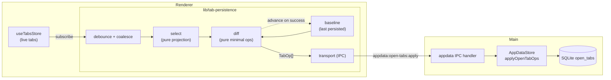
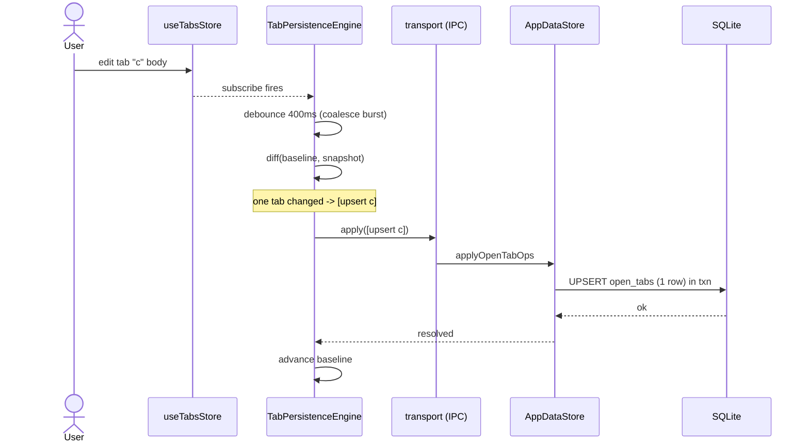
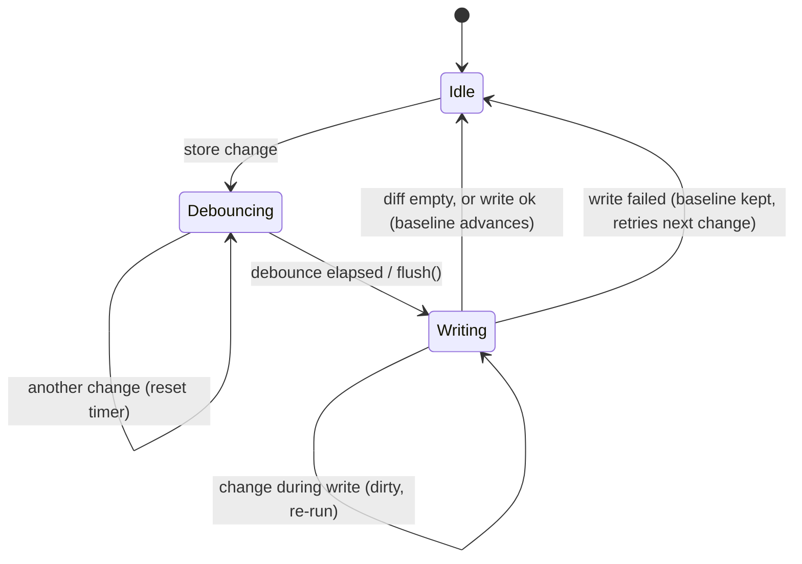
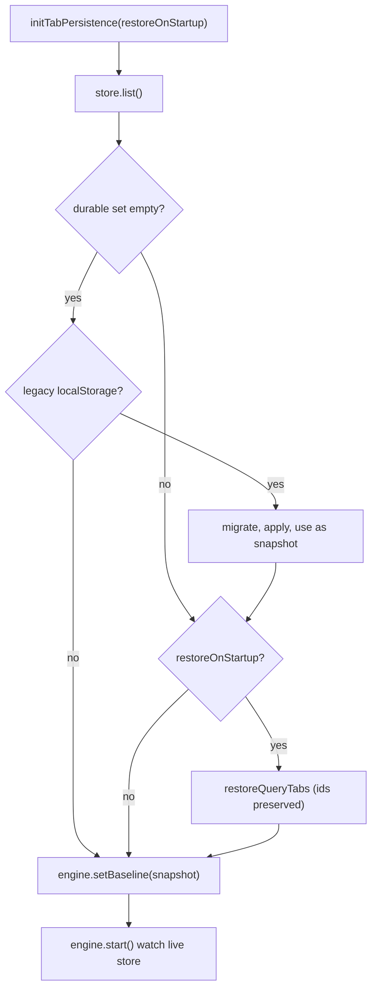

# Tab persistence

Restore-on-startup for open **query tabs** — the un-saved query buffers a user
would hate to lose. This subsystem persists them durably and **incrementally**:
editing one tab writes one row, regardless of how many tabs are open. It is the
write side of Settings → General → *Restore tabs on startup*.

It replaced an earlier renderer-`localStorage` snapshot that rewrote *every* tab
on *every* change, synchronously, on the UI thread — which scaled badly with tab
count and silently dropped saves at the ~5 MB origin quota. The durable home is
now the main-process SQLite [app-data store](./architecture.md) (`open_tabs`
table, reached over IPC), and a small, pure-cored engine in the renderer drives
it.

## Contents

- [Why it's shaped this way](#why-its-shaped-this-way)
- [Architecture](#architecture)
- [The modules](#the-modules)
- [Writing: the incremental hot path](#writing-the-incremental-hot-path)
- [The engine's write lifecycle](#the-engines-write-lifecycle)
- [Startup: hydrate, migrate, restore](#startup-hydrate-migrate-restore)
- [The durable layer](#the-durable-layer)
- [Driver-agnostic content](#driver-agnostic-content)
- [Files](#files)
- [Testing](#testing)

## Why it's shaped this way

| Concern | Old (`localStorage`) | Now (SQLite engine) |
| --- | --- | --- |
| **Thread** | `JSON.stringify(allTabs)` + blocking write on the **UI thread** | renderer fires IPC; the write runs in **main** |
| **Granularity** | whole-blob rewrite on any change — O(N) | one row per changed tab — O(1) for the typing hot path |
| **Durability** | ~5 MB quota cliff → silent data loss | disk-bound, crash-safe commits (WAL) |
| **Shape** | a string blob | typed rows + a tiny op protocol |

The design splits cleanly into a **pure core** (projection + diff — no I/O, no
timers, exhaustively testable) and an **effectful shell** (debounce, IPC,
startup orchestration). That boundary is what makes the behaviour easy to reason
about and to test.

## Architecture



## The modules

Everything lives under `src/renderer/src/lib/tab-persistence/`:

- **`select.ts`** — *pure.* Projects the live tabs store into an
  `OpenTabsSnapshot`: query tabs only (connection-form / settings / plugin /
  table / ER-diagram tabs are transient or connection-bound), durable fields
  only (no results, execution, or txn status). `activeId` is recorded only when
  the focused tab is itself a persisted query tab.
- **`diff.ts`** — *pure.* Computes the minimal `TabOp[]` that turns the last
  persisted snapshot into the current one. A tab is re-`upsert`ed when it is new,
  its content changed, *or* its position moved — so a one-tab edit yields exactly
  one op. Ops are grouped **deletes → upserts → active** so a batch applies
  cleanly in one transaction.
- **`engine.ts`** — the `TabPersistenceEngine`: subscribes, debounces, diffs
  against a held **baseline**, and pushes batches through the transport. Writes
  are **serialized** (a change arriving mid-write re-runs afterwards) and the
  baseline only advances **after** a successful write, so a failed write retries
  rather than being lost. Exposes `setBaseline`, `start`, and `flush`.
- **`transport.ts`** — the IPC adapter (`list` / `apply`) over the app-data
  channels, plus a no-op fallback for environments without the bridge.
- **`migrate.ts`** — one-time import of the legacy `verql:open-tabs`
  localStorage payload (assigning ids, clearing the key so it runs once).
- **`index.ts`** — the single entry point `initTabPersistence()` that wires
  hydrate → migrate → restore → watch and returns a stop function.

## Writing: the incremental hot path

The common case — a user typing in one tab among many — costs a single-row
write:



A burst of keystrokes collapses into one write via the debounce; an unrelated
tab event (results landing, execution flags) produces an **empty diff** and is
skipped entirely.

## The engine's write lifecycle



`flush()` short-circuits the debounce and awaits the in-flight write — used on
`pagehide` (best-effort durability on quit) and by tests for determinism.

## Startup: hydrate, migrate, restore



Restored tabs keep their **persisted id** (`QueryTabSnapshot.id`), so the
engine's baseline lines up with what's on screen and the first post-startup edit
is still a one-row write. Persistence runs even when *Restore tabs on startup* is
off, so the durable set tracks the live tabs and a later opt-in has something to
show.

## The durable layer

Owned by `AppDataStore` (`src/main/appdata/store.ts`), migration **v3**:

```sql
CREATE TABLE open_tabs (
  id              TEXT PRIMARY KEY,   -- the live tab id; lets writes target one row
  position        INTEGER NOT NULL,   -- order in the tab strip
  title           TEXT NOT NULL,
  sql             TEXT NOT NULL,      -- opaque editor buffer (see below)
  connection_id   TEXT,
  db_name         TEXT,
  schema_name     TEXT,
  saved_query_id  TEXT,
  auto_commit     INTEGER NOT NULL DEFAULT 1
);
-- the focused tab id rides in the existing `meta` table
```

- `listOpenTabs()` returns the ordered tabs plus the active id.
- `applyOpenTabOps(ops)` applies an `upsert` / `delete` / `active` batch in a
  **single transaction**.
- IPC: `appdata:open-tabs:list` and `appdata:open-tabs:apply` (see
  [`ipc.md`](./ipc.md)).

## Driver-agnostic content

A query tab is the app's **driver-agnostic** query surface — its editor language
comes from the driver's `editorLanguage` capability, not an assumption of SQL.
The persisted `sql` field is therefore stored and round-tripped as **opaque
text**, never parsed: it holds whatever the driver speaks — a SQL statement, a
MongoDB shell command, a Redis command, a Cypher query. The `sql` name simply
matches the sibling `saved_queries` / `query_history` columns (the app-wide term
for "query text"); it carries no relational meaning. The diff compares content
byte-for-byte rather than interpreting it, so any syntax (including multi-byte
text) round-trips faithfully.

## Files

| Area | Path |
| --- | --- |
| Pure projection | `src/renderer/src/lib/tab-persistence/select.ts` |
| Pure diff | `src/renderer/src/lib/tab-persistence/diff.ts` |
| Engine | `src/renderer/src/lib/tab-persistence/engine.ts` |
| IPC transport | `src/renderer/src/lib/tab-persistence/transport.ts` |
| Legacy migration | `src/renderer/src/lib/tab-persistence/migrate.ts` |
| Entry point | `src/renderer/src/lib/tab-persistence/index.ts` |
| Durable store | `src/main/appdata/store.ts` (`open_tabs`) |
| IPC handlers | `src/main/ipc/appdata.ts` |
| Shared types | `shared/appdata.ts` (`PersistedTab`, `OpenTabsSnapshot`, `TabOp`) |
| Wiring | `src/renderer/src/main.tsx` |
| Tests | `tests/unit/tab-persistence/*.test.ts`, `tests/unit/tab-persistence.test.ts`, `tests/unit/appdata-store.test.ts` |

## Testing

- **Pure core** — `diff` (add / edit / reorder / delete / active / no-op /
  combined / arbitrary non-SQL syntax) and `select` (filtering, field
  projection, active-id rules).
- **Engine** — debounce/coalescing, single-op writes among many tabs, empty-diff
  skips, serialized overlapping writes, baseline-not-advanced-on-failure retry,
  and `flush` / `stop`.
- **Migration** — legacy payload conversion, one-shot clearing, corrupt-input
  tolerance.
- **Durable store** — `open_tabs` CRUD + mixed-batch atomicity in
  `appdata-store.test.ts`.
- **Integration** — `initTabPersistence` end-to-end over an in-memory store
  (round-trip, restore gating, migration, single-batch edit).
