How Verql tells the user that **their response is needed** — most importantly an
approval prompt (an AI write tool, an MCP query authorization) raised while the
window may be in the background — and how any plugin can raise a native desktop
notification.

The design follows Verql's **orchestrator + plugins** rule: the host owns a thin,
delivery-agnostic *seam*; a bundled plugin owns the *delivery policy*; producers
depend on neither.

- [The three layers at a glance](#the-three-layers-at-a-glance)
- [System context](#system-context)
- [Architecture & components](#architecture--components)
- [Use cases](#use-cases)
- [Domain model](#domain-model)
- [Class model](#class-model)
- [Sequence: AI write-tool approval](#sequence-ai-write-tool-approval)
- [Sequence: MCP query approval](#sequence-mcp-query-approval)
- [Sequence: a plugin raises its own notification](#sequence-a-plugin-raises-its-own-notification)
- [Boot & activation](#boot--activation)
- [Dispatcher decision flow](#dispatcher-decision-flow)
- [Attention-request lifecycle](#attention-request-lifecycle)
- [User journey](#user-journey)
- [Requirements](#requirements)
- [Subsystem map](#subsystem-map)
- [Roadmap](#roadmap)
- [Where the code lives](#where-the-code-lives)

## The three layers at a glance

| Layer | Owns | Lives in |
|-------|------|----------|
| **Attention seam** (host glue) | a delivery-agnostic relay: `request` / `resolve` / `subscribe`; provided as the `attention` service | `src/main/attention/attention-hub.ts` |
| **`os-notifications` plugin** (domain logic) | delivery policy (enable, only-when-unfocused, approvals), de-dupe, urgency; provides the `os-notifications` service | `src/main/plugins/bundled/os-notifications/` |
| **Producers** | announce *what* needs attention; never decide *how* it's shown | AI `conversation-manager.ts`, `mcp/server.ts` |

## System context

Who talks to the subsystem, and the one-way flow from "approval raised" to "user
alerted".

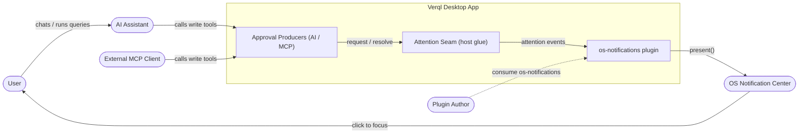

## Architecture & components

The pieces inside the main process, the two services that wire them, and the
existing in-app approval UI in the renderer (which is **unchanged** — the OS
notification is an additional, background-friendly nudge on top of it).

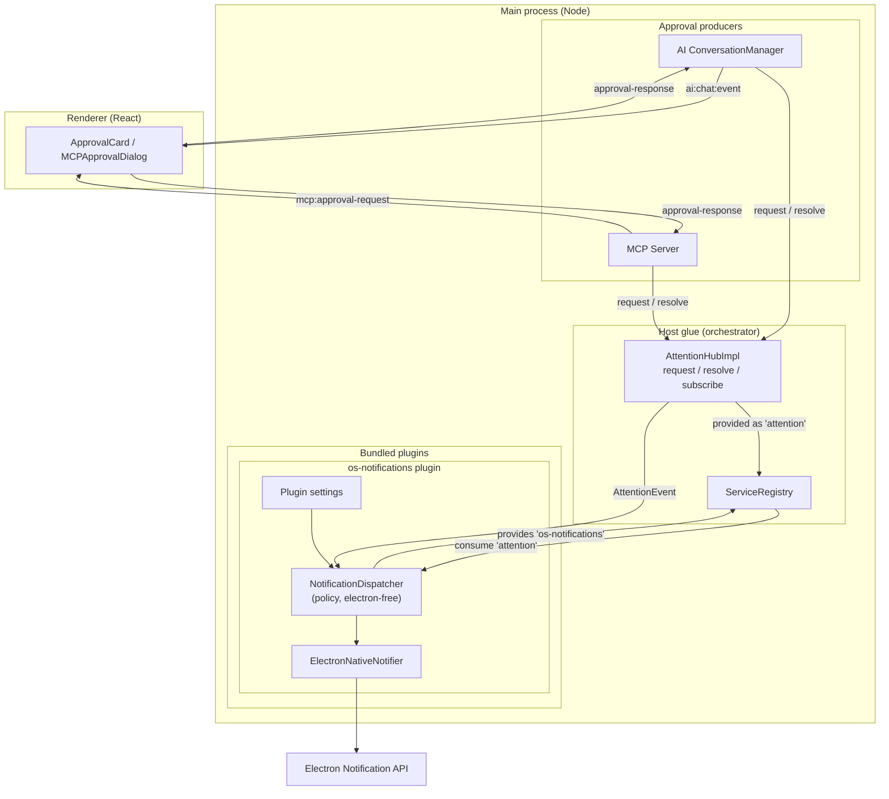

## Use cases

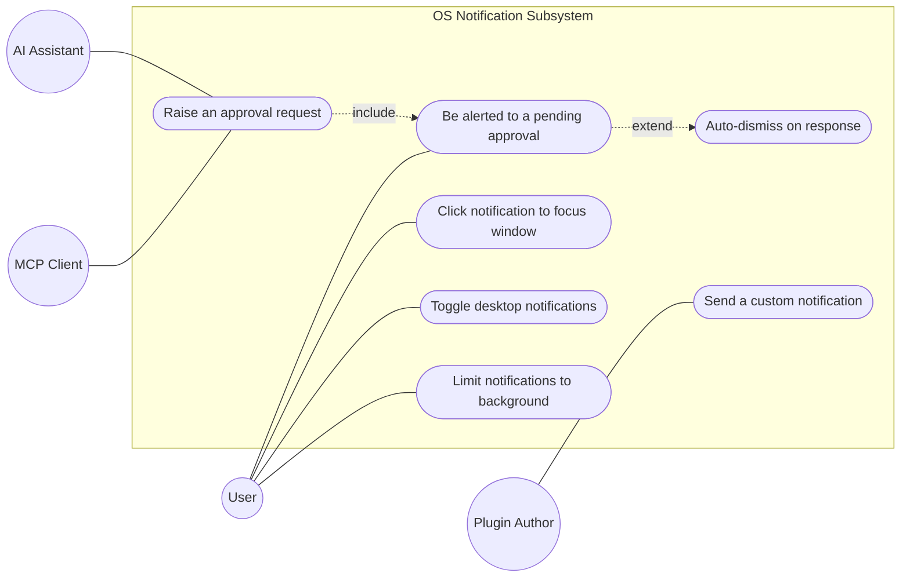

## Domain model

The data that flows through the seam and how it maps to a native notification.

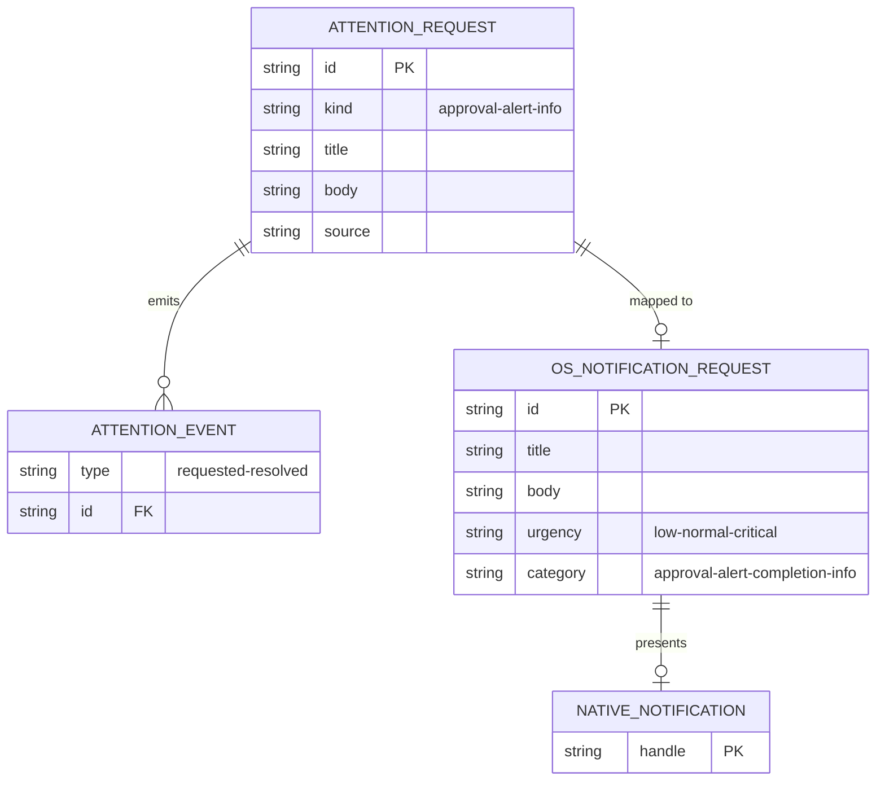

## Class model

The interfaces and the one concrete implementation. Note the dependency
direction: the dispatcher depends on small injected ports (`NativeNotifier`,
`NotificationSettings`), which is what keeps the policy unit-testable without
Electron.

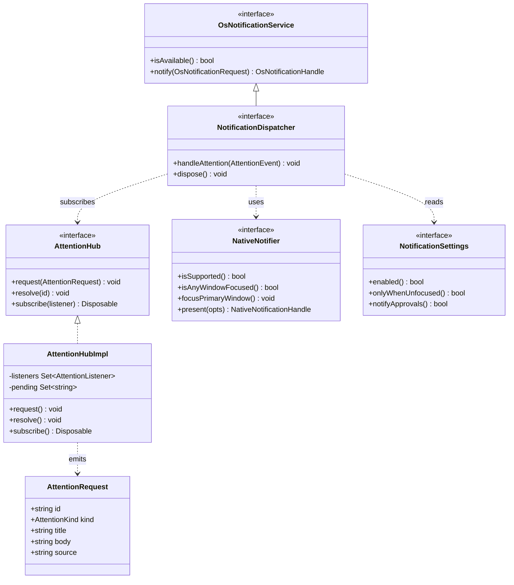

## Sequence: AI write-tool approval

The end-to-end path when the model proposes a write query. The notification and
the in-app `ApprovalCard` are raised together; either the click (focus) or the
card answers the prompt, and resolving the attention dismisses the notification.

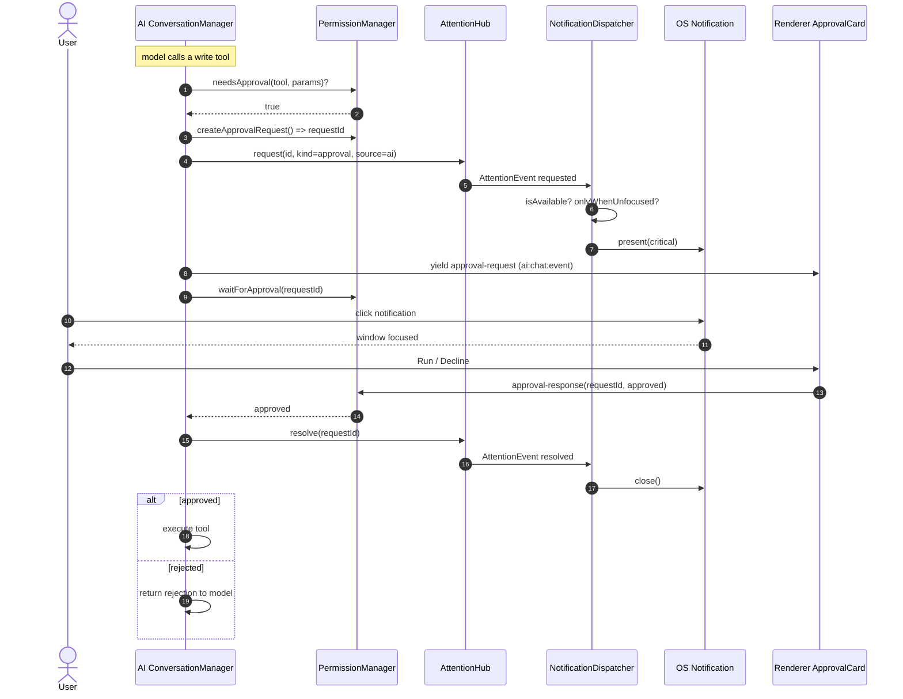

## Sequence: MCP query approval

The MCP client is often headless, so the desktop notification may be the only
nudge the user gets. The 5-minute timeout also resolves the attention so a stale
notification doesn't linger.

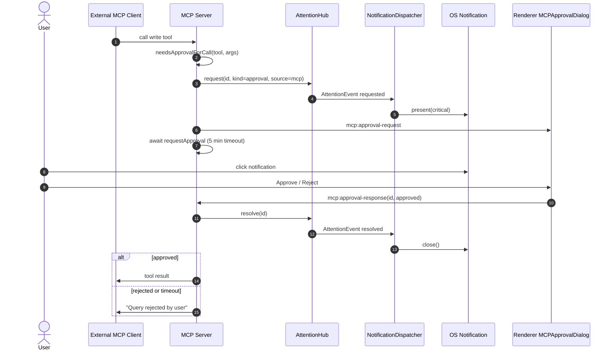

## Sequence: a plugin raises its own notification

Any plugin can reach the user directly through the `os-notifications` service —
without touching Electron and without re-implementing the enable / focus policy.

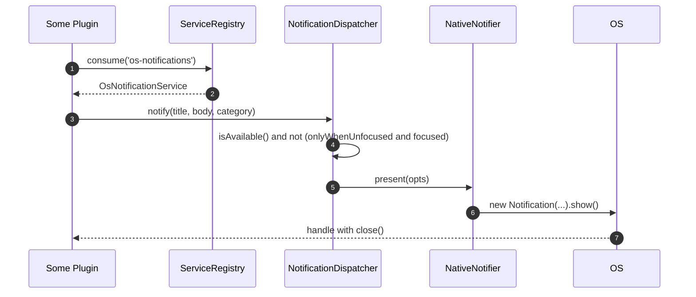

```ts
import type { OsNotificationService } from '../os-notifications'

const notifier = ctx.services.consume<OsNotificationService>('os-notifications')
notifier?.notify({
  title: 'Export finished',
  body: 'orders.csv is ready',
  category: 'completion',
  onClick: () => { /* runs in main; defaults to focusing the window */ },
})
```

## Boot & activation

Why ordering is forgiving: the host provides the `attention` service **before**
any plugin activates, and the plugin uses `onAvailable` (not a bare `consume`)
so it subscribes whether the hub is already present or arrives later.

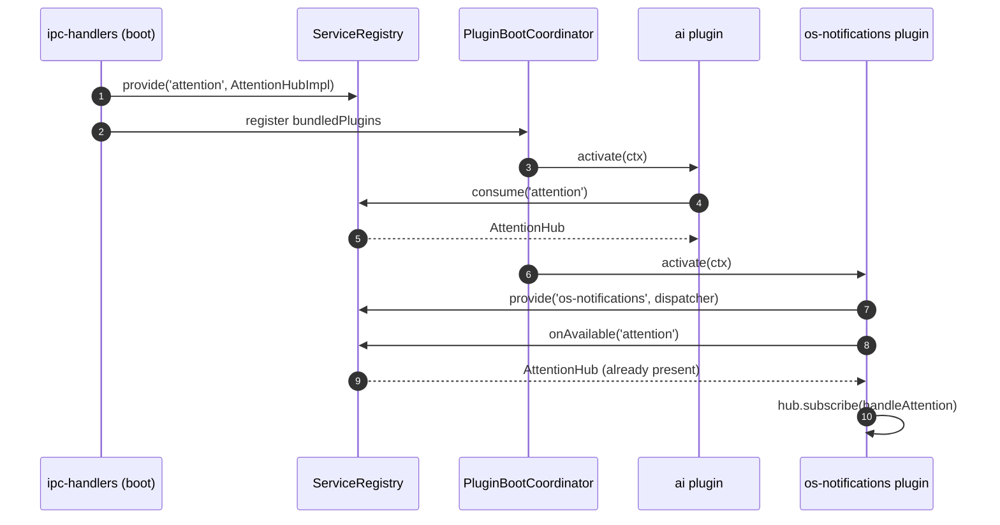

## Dispatcher decision flow

The whole policy that decides whether a request becomes a visible notification.
This is the unit-tested core (`dispatcher.ts`), free of Electron.

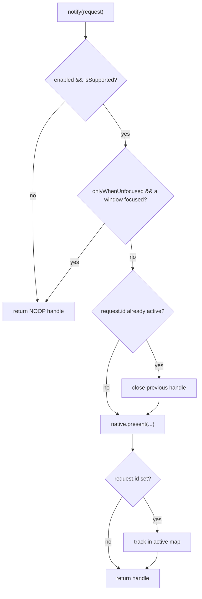

## Attention-request lifecycle

A single request, by `id`, from raised to dismissed. Re-requesting the same `id`
replaces the on-screen notification; resolving dismisses it.

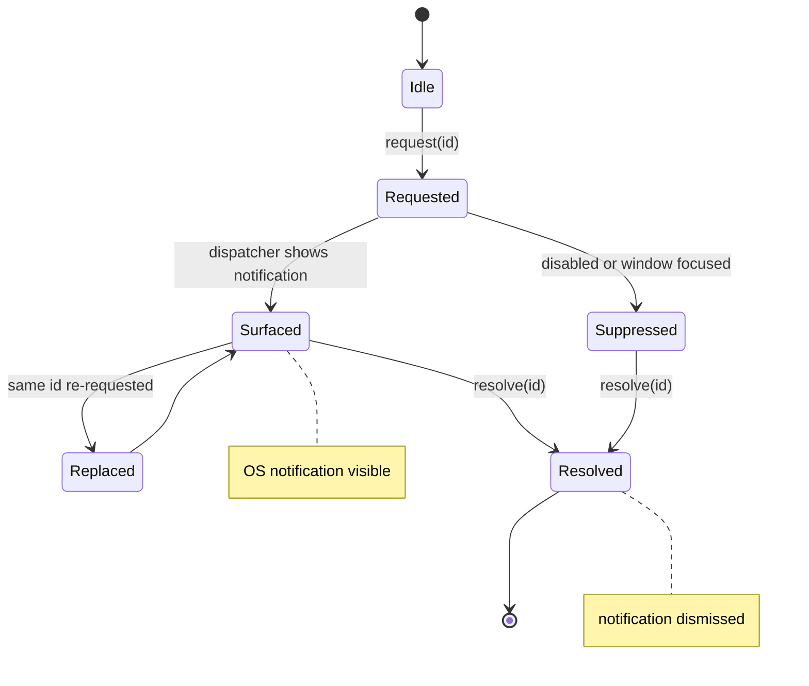

## User journey

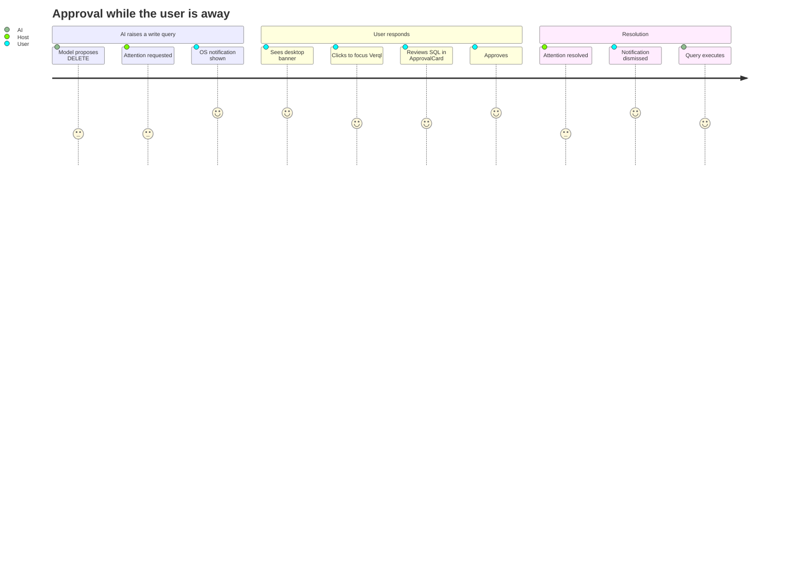

## Requirements

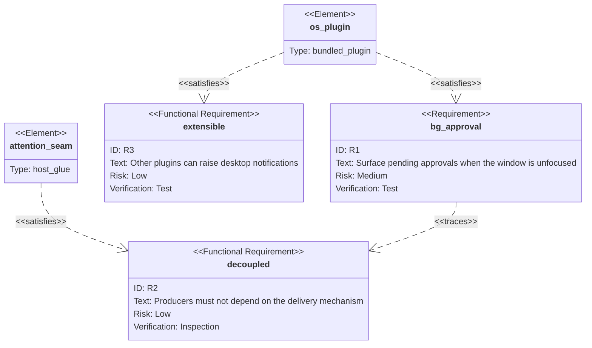

## Subsystem map

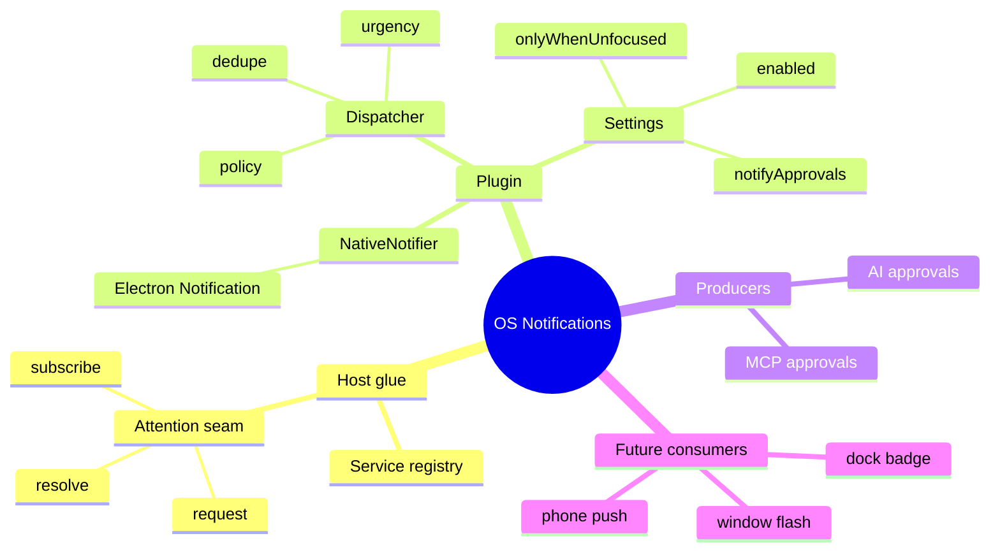

## Roadmap

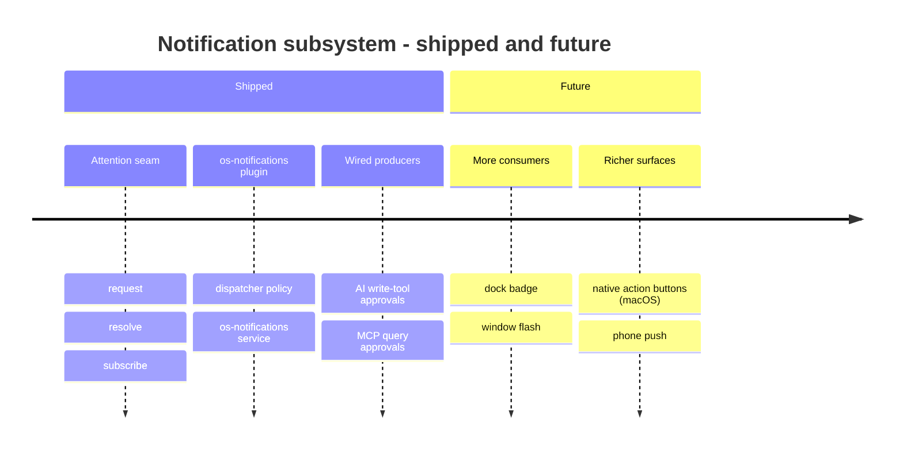

## Where the code lives

| Concern | File |
|---------|------|
| Attention seam (host glue) | `src/main/attention/attention-hub.ts` |
| Plugin manifest + wiring | `src/main/plugins/bundled/os-notifications/index.ts` |
| Delivery policy (electron-free) | `src/main/plugins/bundled/os-notifications/dispatcher.ts` |
| Electron `Notification` adapter | `src/main/plugins/bundled/os-notifications/native-notifier.ts` |
| Host provides `attention`, wires MCP | `src/main/ipc-handlers.ts`, `src/main/ipc/mcp.ts` |
| Producer — AI write-tool approval | `src/main/plugins/bundled/ai/internal/conversation-manager.ts` |
| Producer — MCP query approval | `src/main/mcp/server.ts` |
| Tests | `tests/unit/attention-hub.test.ts`, `tests/unit/os-notifications.test.ts` |

See also: [plugins.md §13](/plugins/#13-desktop-notifications--the-attention-seam)
for the consumer-facing API, and [architecture.md](/develop/architecture/#main-process)
for where the seam sits among the main-process subsystems.
