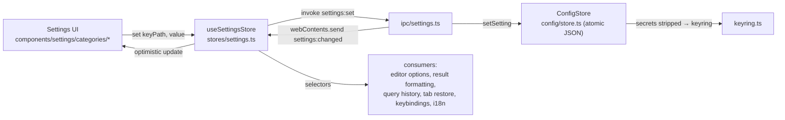

Verql settings follow VS Code's model: **changes auto-apply** (no draft/save
split) and persist immediately. Every setting is wired end-to-end — UI control →
renderer store → IPC → on-disk `ConfigStore` → broadcast back → consumed
somewhere it takes effect. This doc maps that pipeline and where each setting
lands.

## Pipeline

- **Auto-apply:** each control calls `useSettingsStore.set(keyPath, value)`,
  which optimistically updates the in-memory mirror and fires `settings:set`.
- **Broadcast:** the main process echoes `settings:changed` so any other window
  stays in sync (`initSettingsListener`).
- **Hydrate:** on boot the store loads `settings:get-all` and runs
  `mergeWithDefaults` so new keys pick up defaults automatically.

## The pieces

| Piece | File | Role |
|-------|------|------|
| Shape + defaults | `shared/settings.ts` | `AppSettings`, `defaultSettings`, `mergeWithDefaults`, and the `KEYBINDING_ACTION` id registry |
| Renderer mirror | `src/renderer/src/stores/settings.ts` | `useSettingsStore` (`set`, `hydrate`, `resetCategory`) + the change listener |
| IPC handlers | `src/main/ipc/settings.ts` | `settings:get-all/get/set/reset`; routes `ai.openaiKey`/`ai.anthropicKey` into the keyring instead of disk |
| Persistence | `src/main/config/store.ts` | `ConfigStore` — one atomic JSON file; strips keyring-backed secrets before writing |
| UI | `src/renderer/src/components/settings/` | `SettingsLayout` → category components; categories centralized in `lib/settings-categories.ts` (`SETTINGS_CATEGORY`) |

Category ids are a single source of truth (`SETTINGS_CATEGORY` in
`lib/settings-categories.ts`) — the nav, the body dispatch, and the
`open-settings` deep-link all consume it, so opening settings always lands on the
correct category.

## Categories & where settings are consumed

| Category | Key examples | Consumed by |
|----------|-------------|-------------|
| **General** | `queryTimeout`, `defaultPageSize`, `maxHistoryItems`, `confirmDestructiveQueries`, `confirmOnUnsavedClose`, `restoreTabsOnStartup`, `language` | QueryPanel (timeout/confirm), ResultsGrid (page size), query history, tab-actions (close confirm), tab restore, i18n locale |
| **Appearance** | `appearanceMode`, `theme`/`lightTheme`/`darkTheme`, `uiDensity`, `accentColor`, `animations`, sidebar/dock visibility + sizes | `ThemeProvider`, `App` shell layout, `usePanelResize` |
| **Editor** | font, tab size, word wrap, minimap, line numbers, cursor, ligatures, … | `QueryEditor` Monaco options |
| **Data Display** | `nullDisplay`, `dateFormat` (+`customDateFormat`), `numberFormat`, `booleanDisplay`, `truncateTextAt`, `maxColumnWidth` | `ResultsGrid` via `lib/format-cell.ts` |
| **Keybindings** | `keybindings[]` (built-in action ids) | `App` global shortcuts + Monaco editor, both driven by the array; rebind UI in `KeybindingsSettings` |
| **Connections** | (driver-contributed only) | per-driver plugin settings; SSL/ports live with the driver |
| **AI** | `ollamaEndpoint`, `activeProvider`/`activeModel`, OpenAI/Anthropic keys | AI plugin; keys stored in the keyring, redacted on read |
| **MCP** | `enabled`, `port`, `autoPort`, `readOnly`, `maxRows`, `disabledTools`, `token` | MCP server |
| **Plugins** | `plugins{}`, `disabledPlugins[]`, `pluginGrants{}` | plugin host + per-plugin contributed settings |

## Notable features

- **Query history** (`maxHistoryItems`) — runs are recorded to the SQLite
  app-data `query_history` table, capped to the preference, surfaced via the
  Saved/History toggle. See `stores/query-history.ts`.
- **Tab restore** (`restoreTabsOnStartup`) — open query tabs are persisted
  incrementally (one row per tab) to the SQLite app-data store and re-opened on
  launch. The pure diff/select core, the debounced coalescing engine, the IPC
  transport, and the one-time localStorage migration live in
  `lib/tab-persistence/`; the durable side is AppDataStore's `open_tabs` table.
- **Keybinding rebind** — the persisted `keybindings[]` drives both App-level
  shortcuts (via `matchesAccelerator`) and the editor; the page captures a chord
  and writes compatible key strings. Action ids: `KEYBINDING_ACTION`.
- **Secrets** — AI API keys and the MCP token never touch disk; `settings:set`
  redirects them to the OS keyring and reads are redacted.
- **Language** (`general.language`) — selects the i18n locale (see
  [i18n.md](/develop/i18n/)).

## Adding a setting

1. Add the field + default to `AppSettings` / `defaultSettings` in
   `shared/settings.ts` (it merges into existing configs automatically).
2. Render a control in the right `components/settings/categories/*` file, calling
   `setSetting('category.key', value)`. Use `t()` for the label/description.
3. **Consume it** where it takes effect (a store/component selector). A persisted
   setting with no consumer is dead — wire it through.
4. Secrets go through the keyring (mirror the AI-key handling in
   `ipc/settings.ts`), never the config JSON.

## Plugin-contributed settings

Plugins declare settings in their manifest; they render under the relevant
category via `PluginContributedSettings` and persist into `settings.plugins[<id>]`
through `plugins:set-setting`. See [plugins.md](/plugins/).
